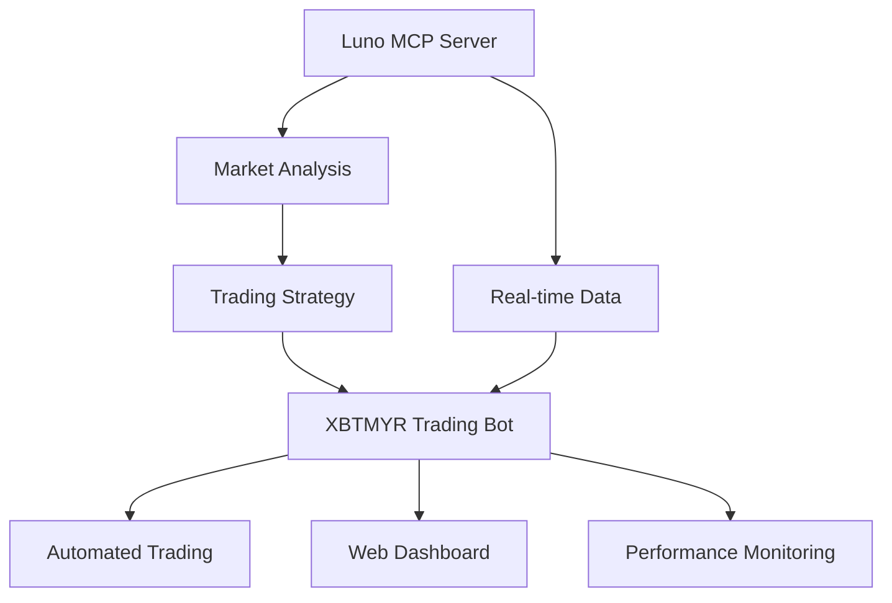

# 🚀 XBTMYR Trading Bot

## Moved to Standalone Repository

The XBTMYR trading bot has been moved to a separate directory to avoid confusion between the MCP server project and the trading bot application.

## New Location

The trading bot is now located at:
```
../xbtmyr-trading-bot/
```

## What's the Trading Bot?

Based on the market analysis performed using this MCP server, I created a complete production-ready trading bot that:

- **Uses Luno MCP Server Data**: Leverages the same API endpoints as this MCP server
- **Advanced Technical Analysis**: RSI, EMA, MACD, Bollinger Bands
- **Professional Risk Management**: Stop losses, position sizing, portfolio protection
- **Web Dashboard**: Real-time monitoring and performance tracking
- **Safety First**: Dry-run mode, comprehensive logging, error handling

## Quick Start

```bash
# Navigate to trading bot
cd ../xbtmyr-trading-bot

# Run automated setup
./setup.sh

# Test installation
python3 test_bot.py

# Run in simulation mode
python3 run_bot.py --dry-run
```

## Relationship to MCP Server



- **MCP Server**: Provides market data and analysis tools
- **Trading Bot**: Implements automated trading based on analysis
- **Both Projects**: Use same Luno API but serve different purposes

## Features Overview

### MCP Server (This Project)
- Market data access via MCP protocol
- Integration with Claude Desktop
- Historical price analysis
- Account balance checking
- Manual trading operations

### Trading Bot (Standalone)
- Automated trading execution
- Technical analysis engine
- Risk management system
- Web-based monitoring dashboard
- Performance tracking and reporting

## Documentation

- **Trading Bot**: See `../xbtmyr-trading-bot/README.md`
- **Quick Start**: See `../xbtmyr-trading-bot/QUICK_START.md`
- **MCP Server**: See `README.md` in this directory

---

*The trading bot was created as a practical application of the market analysis capabilities provided by this MCP server.*